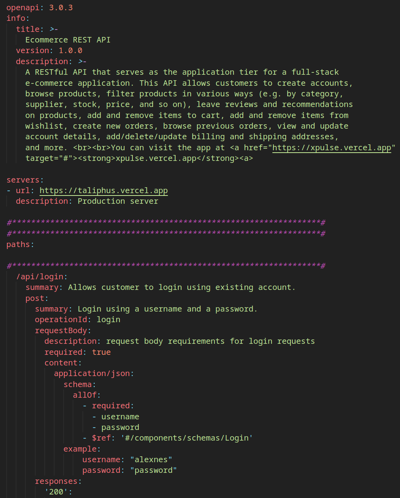

# [Swagger UI API documentation](https://majid-l.github.io/swagger-ui-docs/)

[**Live Swagger UI**](https://majid-l.github.io/swagger-ui-docs/)

This repository contains a Swagger UI interface that documents one of my REST API projects. This REST API is for an e-commerce application - link below.

## Full stack application
Use this link to visit the actual full-stack e-commerce application:

[Visit the app](https://xpulse.vercel.app)
